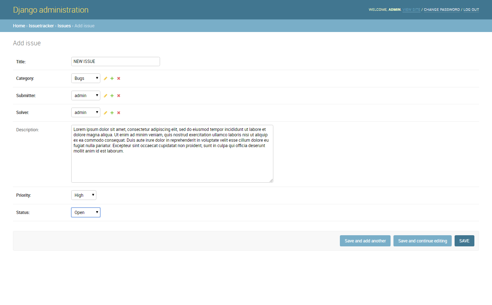
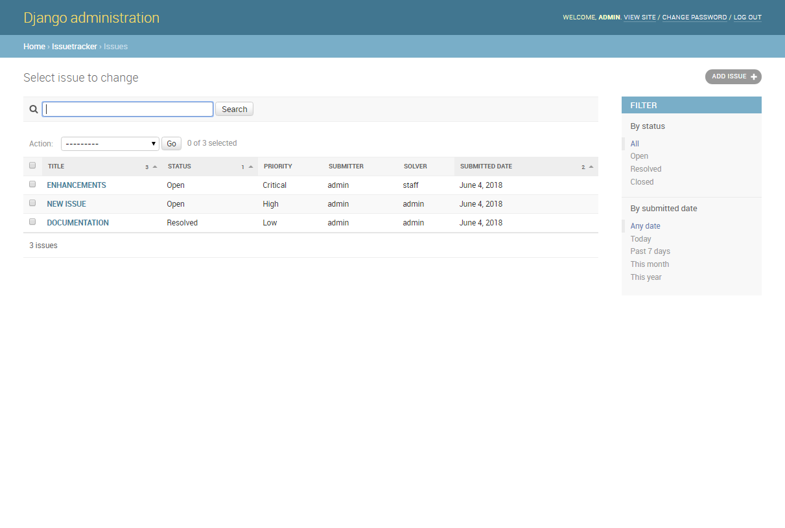

# Django Issue Tracker

A simple issue tracker in django

## Features

* django 2.0 and python 3.6
* pipenv for virtualenv

## First-time setup

1.  Make sure python 3.6x and pipenv are already installed
2.  Clone the repo and configure the virtualenv

```
git clone https://github.com/rayray1/django-issue-tracker.git
cd django-issue-tracker
pipenv install
pipenv shell
```

3.  Login and view list via the django admin page

```
python manage.py runserver
```

Load the site at http://127.0.0.1:8000/admin

```
Login credentials (for both superuser and staff)

superuser - (username = admin) (password = password123)
staff - (username = staff) (password = password123)
```


<!--  -->


<!--  -->
